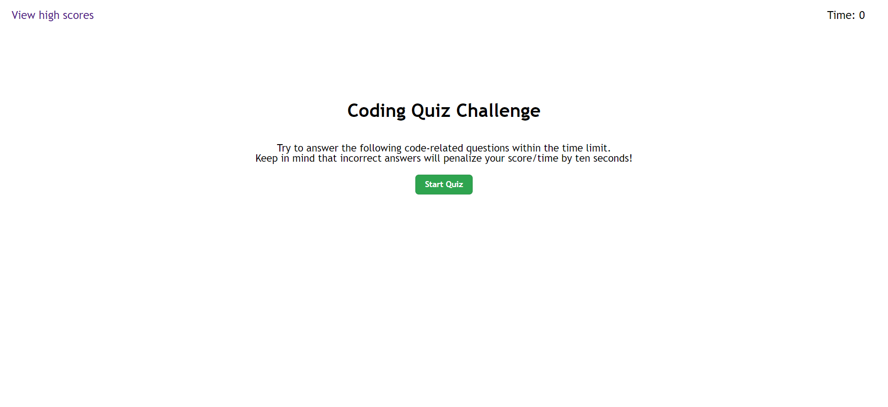
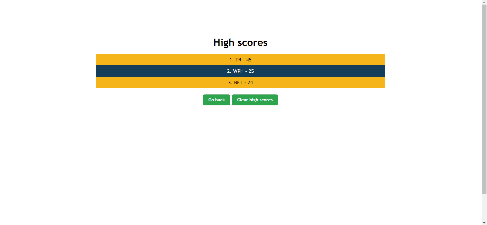

# Module 4 challenge Webpage

## Description

This Module 4 Challenge was created to complete the Module 4 Challenge of the bootcamp.

The project was built upon the template code retrieved from the solution code of the activity 28-Stu_Mini-Project (accessible in
https://monash.bootcampcontent.com/monash-coding-bootcamp/MONU-VIRT-FSF-PT-08-2022-U-LOLC/-/tree/main/04-Web-APIs/01-Activities/28-Stu_Mini-Project). Only the structure of the code has been utilized while the other parts of the project were built from scratch.

This project was made to build a small coding quiz that allow users to store their initials and score in a scoreboard after the game ends. The final score is determined by how many seconds are left after the quiz is finished, and each wrong answer will deduct 10 seconds from the timer.

HTML, CSS and JavaScript have been used to make this webpage.

## Installation

N/A

## Usage

Link to the deployed website: https://wongpakho814.github.io/module-4-challenge/

## Credits

N/A

## License

N/A
